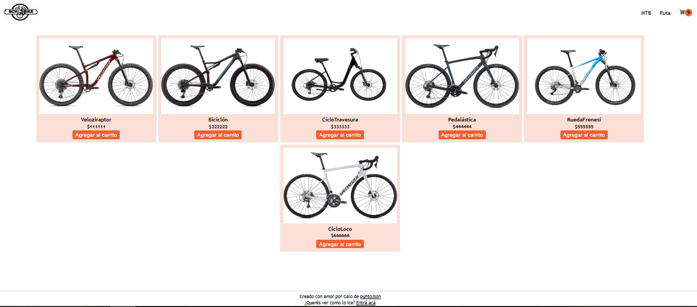
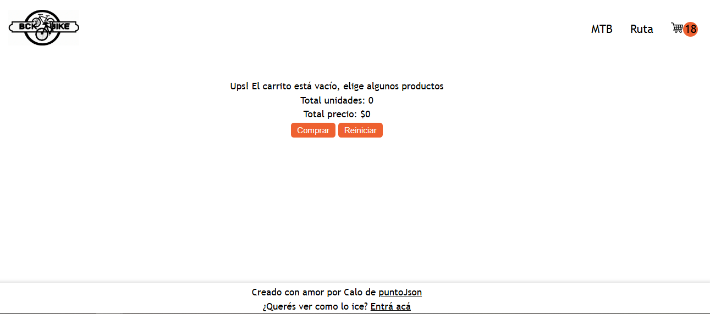

# **CARRITO DE COMPRAS JS**

Programa un carrito de compras con Javascript

## **Tech Stack**

**Client:** HTMT, CSS, JS

**Server:** JS

## Demo

https://htmlpreview.github.io/?https://github.com/lucho-39/CarritoDeEnvivo/blob/main/index.html

## Screenshots

> [!NOTE]
> https://www.youtube.com/watch?v=lduIpYA66mM
