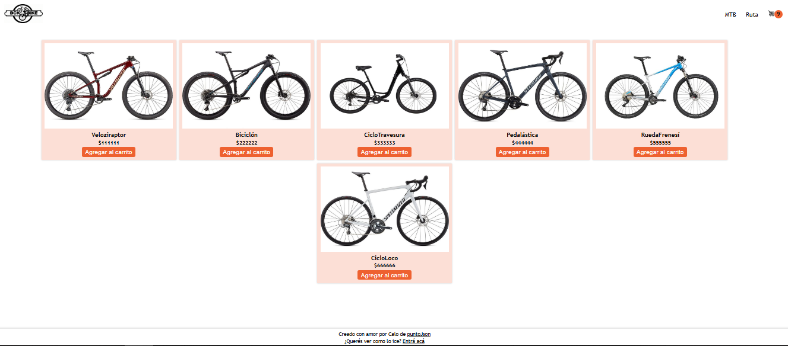
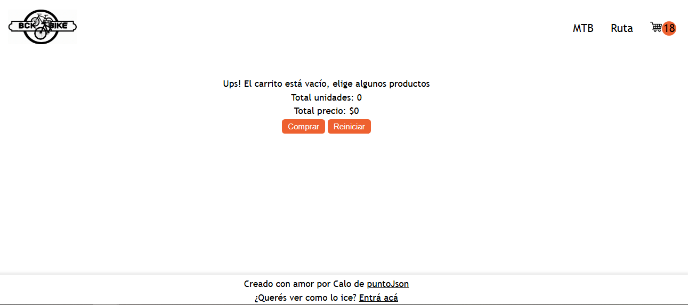

# **CARRITO DE COMPRAS JS**

Carrito de compras de bicicletas hecho con JavaScript vanilla: catálogo, carrito y
checkout funcionando del lado del cliente con `localStorage`.

Proyecto basado en el tutorial de [puntoJson](https://youtube.com/@puntoJson):

- https://www.youtube.com/watch?v=lduIpYA66mM
- https://www.youtube.com/watch?v=UEjf7k32mTg

## **Tech Stack**

**Client:** HTML, CSS, JS vanilla (DOM + localStorage)

**Server (opcional):** Node.js, Express, MySQL

## **Demo**

https://lucho-39.github.io/CarritoDeEnvivo/

La aplicación funciona **sin backend**, así que también podés abrir `index.html` en el
navegador o servir la carpeta con cualquier servidor estático:

```bash
npx serve .
```

El sitio se publica con GitHub Pages desde la rama `main` (carpeta raíz), y el archivo
`.nojekyll` desactiva el procesamiento de Jekyll para servir los archivos tal cual.

## **Screenshots**





## **Estructura**

```
index.html            Catálogo de productos
cart.html             Carrito con totales y acciones
compra-exitosa.html   Confirmación de compra
js/
  config.js           Interruptor de fuente de datos (local o API)
  bicicletas.js       Catálogo local de productos
  productosService.js Obtención del catálogo
  cartService.js      Lógica del carrito y la compra
  cart.js             Render de la página del carrito
  index.js            Render del catálogo
src/                  Backend opcional (Express + MySQL)
```

## **Fuente de datos**

Todo se maneja desde `js/config.js`:

```js
const API_URL = "http://localhost:4000";
const USAR_API = false;
```

- `USAR_API = false` (por defecto): el catálogo sale de `js/bicicletas.js` y la compra
  se resuelve localmente. Es el modo que funciona sin backend.
- `USAR_API = true`: el catálogo se pide a la API de `src/`. Requiere el backend
  levantado.

## **Backend opcional**

El backend sirve el catálogo desde MySQL, valida los precios del lado del servidor y
persiste cada pedido. Es opcional: el front funciona sin él mientras `USAR_API` sea
`false`.

1. Instalar dependencias:

```bash
npm install
```

2. Crear las tablas y los datos de ejemplo:

```bash
mysql -u root -p < sql/schema.sql
```

`sql/schema.sql` es idempotente: crea `producto`, `pedido` y `pedido_detalle`, y carga
las 6 bicicletas solo si la tabla `producto` está vacía.

3. Copiar las credenciales de ejemplo y completarlas:

```bash
cp .env.example .env
```

Además de las credenciales de MySQL, `.env` acepta `PORT` (por defecto `4000`) y
`CORS_ORIGINS` (orígenes permitidos, separados por coma).

4. Levantar el servidor:

```bash
npm start        # o npm run dev para recarga automática
```

La API escucha en `http://localhost:4000`:

| Método | Ruta               | Descripción                   |
| ------ | ------------------ | ----------------------------- |
| GET    | `/productos`       | Devuelve el catálogo          |
| POST   | `/carrito/comprar` | Valida y guarda un pedido     |

`POST /carrito/comprar` espera únicamente el id y la cantidad de cada producto:

```json
{ "items": [ { "id": 1, "cantidad": 2 } ] }
```

El servidor ignora cualquier precio que venga del cliente: los busca en la base,
calcula el total y guarda el pedido en una transacción. Responde `201` con
`{ "pedidoId": 1, "total": 222222 }`.

Para usarla desde el front, poné `USAR_API = true` en `js/config.js`.
